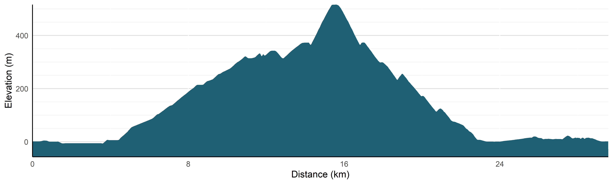

# Zwift Speed Testing

This repo is devoted to speed testing in Zwift &mdash; a training and racing platform for cyclists. Within Zwift, users can choose between different bike frames and wheels, and these are known to affect performance[1](https://zwiftinsider.com/charts-frames/), [2](https://zwiftinsider.com/charts-wheels/), [3](https://zwiftinsider.com/fastest-tt-bikes/). I perform my own speed testing to judge optimal setups on Zwift in contexts other than those covered in the [ZwiftInsider speed tests](https://zwiftinsider.com/category/reference/speed-tests/).

### Example: Mountain Route

The ZwiftInsider speed tests perform tests on two routes &mdash; the very flat Tempus Fugit and the very not-flat Alpe Du Zwift. While these tests provide insight about performance in two extreme settings, most routes represent some kind of midground of some flat and some climbing (and some descending). When trying to pick which bike to go for, riders then need to judge how much to weight aerodynamic and climbing performance on the basis of the course they are tackling. For example, the Mountain Route (Watopia) has a substantial amount of all three, including the very steep Radio Tower climb (and descent). 

Rather than try to make a judgement about which bike performs best, by using a bot-rider (where power output is controlled by computer, not by a rider on a trainer) I can test a range of frames and wheels to find the optimal setup in a tightly controlled experiment and without breaking a sweat. Setting a 75kg, 182cm tall bot to ride at 300 Watts (replicating ZwiftInsider) reveals that the best bike* for this route is the Specialized Venge S-Works with DT Swiss Arc 1100 DiCut Disc wheels.

|Frame |Wheel |Time | 
|------|------|-----|
|Specialized Venge S-Works|DT Swiss ARC 1100 DiCut Disc|54:00   |      
|Scott Addict RC|DT Swiss ARC 1100 DiCut Disc|54:05 (+00:05)|
|Canyon Aeroad 2021|DT Swiss ARC 1100 DiCut Disc|54:05 (+00:05)|
|TRON|TRON|54:05 (+00:05)|
|Specialized Aethos S-Works|DT Swiss ARC 1100 DiCut Disc|54:09 (+00:09)|
|Specialized Venge S-Works|ENVE SES 7.8|54:09 (+00:09)|
|Specialized Venge S-Works|ZIPP 808|54:13 (+00:13)|
|Specialized Venge S-Works|ZIPP 454|54:13 (+00:13)|
|Specialized Venge S-Works|DT Swiss ARC 1100 DiCut 62|54:14 (+00:14)|
|Scott Addict RC|ENVE SES 7.8|54:14 (+00:14)|

Eyeballing it, I wouldn't have expected such an aggresively aero setup to be the fastest given the amount of steep climbing in this route &mdash; I'd probably have gone for a Scott Addict RC with ZIPP 454 wheels which would come in 18 seconds slower than the Venge and disc wheels!

----

\* Among 25 bikes formed of: 
* Scott Addict RC frame
* Specialized Venge S-Works frame
* Specialized Aethos S-Works frame
* Canyon Aeroad 2021 frame
* DT Swiss ARC 1100 DiCut Disc wheelset
* DT Swiss ARC 1100 DiCut 62 wheelset
* ZIPP 808 wheelset
* ZIPP 454 wheelset
* ENVE SES 7.8 wheelset
* Lightweight Meilenstein wheelset
* Tron bike
