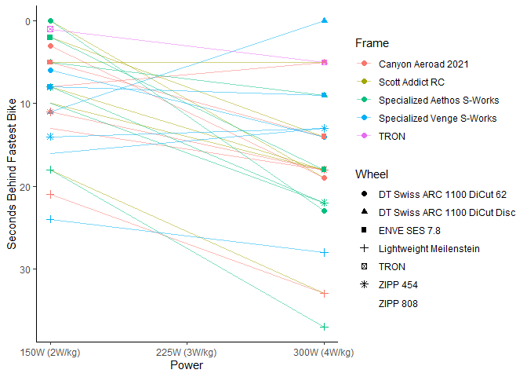
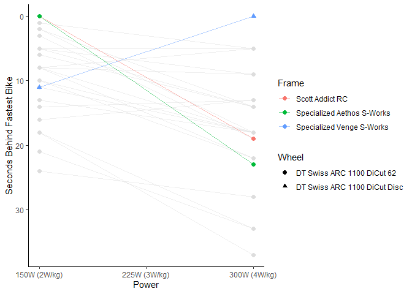
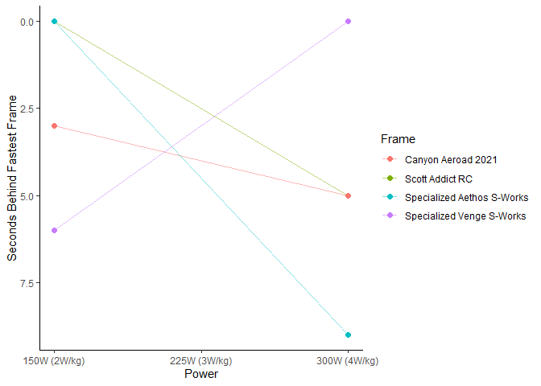
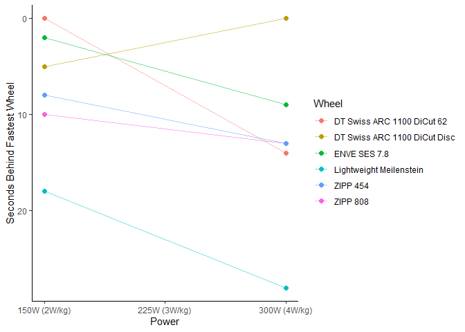

*Which is the best bike for this route?* is not the (only) question you
should be asking
================

- Importance of bike choice; racing, chasing PRs, KOMs and sprints
- Resource of ZwiftInsider speed test data and derivatives (e.g. my data
  browser, ZwifterBikes)
  - Details of testing
  - Judging routes, might expect fairly aero setup to do well even on
    fairly climb heavy routes like Mountain Route (survey?)

``` r
top_300[1:20]
```

    ##                          frame                        wheel           time
    ##  1:  Specialized Venge S-Works DT Swiss ARC 1100 DiCut Disc 54:00         
    ##  2:            Scott Addict RC DT Swiss ARC 1100 DiCut Disc 54:05 (+00:05)
    ##  3:         Canyon Aeroad 2021 DT Swiss ARC 1100 DiCut Disc 54:05 (+00:05)
    ##  4:                       TRON                         TRON 54:05 (+00:05)
    ##  5: Specialized Aethos S-Works DT Swiss ARC 1100 DiCut Disc 54:09 (+00:09)
    ##  6:  Specialized Venge S-Works                     ZIPP 808 54:13 (+00:13)
    ##  7:  Specialized Venge S-Works                     ZIPP 454 54:13 (+00:13)
    ##  8:  Specialized Venge S-Works   DT Swiss ARC 1100 DiCut 62 54:14 (+00:14)
    ##  9:            Scott Addict RC                     ZIPP 808 54:18 (+00:18)
    ## 10:         Canyon Aeroad 2021                     ZIPP 808 54:18 (+00:18)
    ## 11:            Scott Addict RC                     ZIPP 454 54:18 (+00:18)
    ## 12:         Canyon Aeroad 2021                     ZIPP 454 54:18 (+00:18)
    ## 13:            Scott Addict RC   DT Swiss ARC 1100 DiCut 62 54:19 (+00:19)
    ## 14:         Canyon Aeroad 2021   DT Swiss ARC 1100 DiCut 62 54:19 (+00:19)
    ## 15:                 Zwift Aero DT Swiss ARC 1100 DiCut Disc 54:20 (+00:20)
    ## 16: Specialized Aethos S-Works                     ZIPP 808 54:22 (+00:22)
    ## 17: Specialized Aethos S-Works                     ZIPP 454 54:22 (+00:22)
    ## 18: Specialized Aethos S-Works   DT Swiss ARC 1100 DiCut 62 54:23 (+00:23)
    ## 19:  Specialized Venge S-Works      Lightweight Meilenstein 54:28 (+00:28)
    ## 20:            Scott Addict RC      Lightweight Meilenstein 54:33 (+00:33)

- But ZI tests performed using a very specific profile of rider; 300w,
  182cm, 75kg
  - This doesn’t match all riders on Zwift
  - Varying rider power/power-to-weight ratio should change the relative
    importance of aerodynamic performance and climbing performance, with
    slow riding placing a great emphasis on climbing performance
  - This means judging which bike is best for a given route is not just
    about how much climbing occurs on a route, but also needs to
    incorporate the profile of the rider
- To test how rider power/power-to-weight affects performance and
  recommended frame and wheel choice, I used a bot to test performance
  of a 182cm, 75kg rider riding at 300W (4W/kg) and 150W (2W/kg)
  - I did this test on Watopia’s Mountain Route as a more representative
    route; it has some flat, some mixed difficulty of climbing and some
    descents
  - ZI tests were on very extreme routes, either completely flat or
    steep climbing (so should be less sensitive to rider variation)
  - Frame and wheel performance is independent, so wheels were tested on
    a Zwift Aero frame and frames tested with Zwift 32mm Carbon wheels,
    and frame and wheel effects used to get predicted times for each
    unqiue combination
    - These predicted times were verified for a random selection of
      bikes

``` r
top_150[1:20]
```

    ##                          frame                        wheel              time
    ##  1:            Scott Addict RC   DT Swiss ARC 1100 DiCut 62 01:25:13         
    ##  2: Specialized Aethos S-Works   DT Swiss ARC 1100 DiCut 62 01:25:13         
    ##  3:                       TRON                         TRON 01:25:14 (+00:01)
    ##  4:         Canyon Aeroad 2021   DT Swiss ARC 1100 DiCut 62 01:25:16 (+00:03)
    ##  5:            Scott Addict RC DT Swiss ARC 1100 DiCut Disc 01:25:18 (+00:05)
    ##  6: Specialized Aethos S-Works DT Swiss ARC 1100 DiCut Disc 01:25:18 (+00:05)
    ##  7:  Specialized Venge S-Works   DT Swiss ARC 1100 DiCut 62 01:25:19 (+00:06)
    ##  8:         Canyon Aeroad 2021 DT Swiss ARC 1100 DiCut Disc 01:25:21 (+00:08)
    ##  9:            Scott Addict RC                     ZIPP 454 01:25:21 (+00:08)
    ## 10: Specialized Aethos S-Works                     ZIPP 454 01:25:21 (+00:08)
    ## 11:            Scott Addict RC                     ZIPP 808 01:25:23 (+00:10)
    ## 12: Specialized Aethos S-Works                     ZIPP 808 01:25:23 (+00:10)
    ## 13:  Specialized Venge S-Works DT Swiss ARC 1100 DiCut Disc 01:25:24 (+00:11)
    ## 14:         Canyon Aeroad 2021                     ZIPP 454 01:25:24 (+00:11)
    ## 15:         Canyon Aeroad 2021                     ZIPP 808 01:25:26 (+00:13)
    ## 16:  Specialized Venge S-Works                     ZIPP 454 01:25:27 (+00:14)
    ## 17:  Specialized Venge S-Works                     ZIPP 808 01:25:29 (+00:16)
    ## 18:            Scott Addict RC      Lightweight Meilenstein 01:25:31 (+00:18)
    ## 19: Specialized Aethos S-Works      Lightweight Meilenstein 01:25:31 (+00:18)
    ## 20:         Canyon Aeroad 2021      Lightweight Meilenstein 01:25:34 (+00:21)

<!-- --><!-- --><!-- --><!-- -->
